---

## 🧑‍💻 About Me

<table>
<tr>
<td width="50%">

### 🔍 Quality Assurance
Experienced in software testing methodologies, bug tracking, and automation tools. I ensure every product meets the highest reliability standards before it reaches users.

</td>
<td width="50%">

### 🎨 UI/UX Design
Skilled in wireframing, prototyping, and crafting user-friendly interfaces with **Figma**, **Canva** and **draw.io** — turning ideas into intuitive digital experiences.

</td>
</tr>
<tr>
<td width="50%">

### 📊 Data Administration
Proficient in database management, data validation, and ensuring data integrity using both SQL and NoSQL databases to keep systems accurate and reliable.

</td>
<td width="50%">

### 🌱 Currently Learning
Expanding into **usability testing**, **accessibility design (WCAG)**, **MobileNetV2**, and **transfer learning** techniques to build smarter, more inclusive products.

</td>
</tr>
</table>

---

## 🛠️ Tech Stack & Tools

### 💻 Programming Languages

---

### 🌐 Frontend & Mobile

---

### 🗄️ Databases

---

### ☁️ Cloud & DevOps

---

### 🤖 AI / ML & Data Science

---

### 🧰 Frameworks & Tools

---

## 📊 GitHub Stats

---

## 🏆 GitHub Trophies

---

## 🎯 Career Goal

> *"Seeking an opportunity to apply my skills in quality assurance to improve product performance and user satisfaction. Let's connect and collaborate on building high-quality, user-centric solutions!"* 🚀

---

## 🤝 Connect With Me

---

